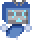

## GungeonCraft: A mechanics-focused mod for Enter the Gungeon

|                                 |                                       |                                      |
| -------------                   | :-------------:                       | :-------------:                      |
|  |       |     |
|  |          |     |
|    |  |  |
|                                 |                                       |                                      |

### Features

- 146 new items, including
	+ 79 new guns
	+ 45 new passive items
	+ 22 new active items
- Lore for all new guns and items
- A new custom character: Rogo from [Pogo Rogue](https://store.steampowered.com/app/2870280/Pogo_Rogue/)
- 90 stylish cosmetic hats, accessible via a new hat room near Winchester in the Breach
- Companion Shop: sells 3 random unlocked companions at a 30% discount
- Bartering Shop: trades 3 random D-A tier items for any higher-tiered item
- Insurance Shop: sells insurance policies that let you carry items over to the next run
- Hecked Mode: randomize enemies' guns for a truly hecked playing experience (enabled via the Mod Config menu)
- A new secret boss
- Gun mastery system
- You can pet Junior \o/
- You can become the greatest janitor the Gungeon has ever seen O:
- And more!

### Goals

- **Balance and Diversity**: all items and guns should be fun, engaging, and useful in a variety of situations
- **Fun New Mechanics**: most items and guns should offer their own distinct ways of interacting with the Gungeon
- **Playstyle Variety**: defensive and strategic play should feel as rewarding as aggressive and proactive play

### FAQ

* Found a Bug?
	- [Open an Issue on GitHub](https://github.com/pcrain/GungeonCraft/issues)! Please bear in mind that I work on this in my free time for fun, so I might not fix every bug, but I'll do my best to get to all of the important ones. C:
* Where do I find the new boss?
	- Try talking to Bello a few dozen times! He'll give you a hint eventually (dialogue is RNG and I can't find a way around it D: ).
* Why does my gun say "Normal" above it?
	- Try beating the new boss :>

### Wiki

All of the information and lore you'll ever need can be found in-game in the Ammonomicon. O:

That said, the GungeonCraft wiki page contains detailed information about the mod's weapons, items, and NPCs, and [can be found here](https://enterthegungeon.wiki.gg/wiki/Modding/GungeonCraft)!

### Changelog

See the [changelog page](https://github.com/pcrain/GungeonCraft/blob/master/changelog.md)!

### Credits

See the [credits page](https://github.com/pcrain/GungeonCraft/blob/master/credits.md)!
