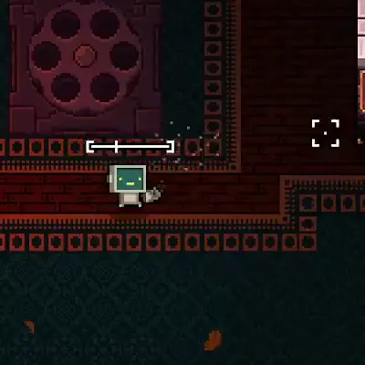
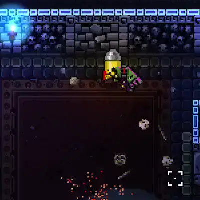
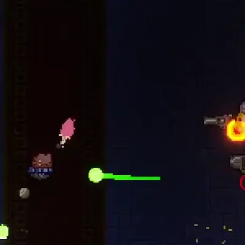
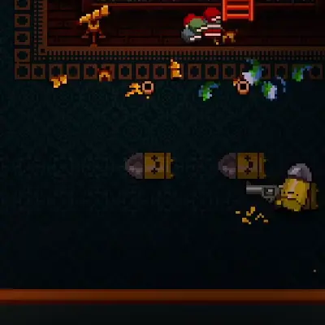
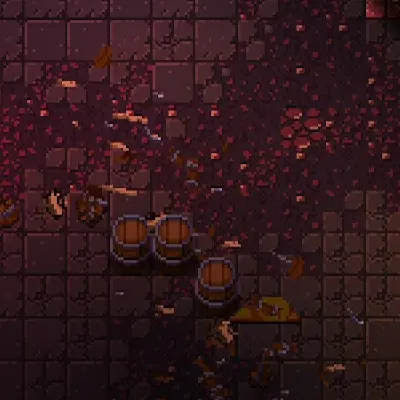
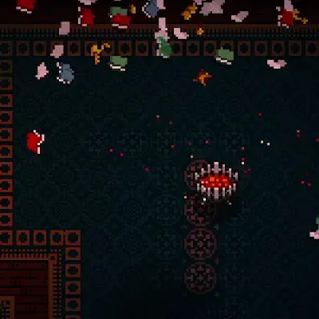

## GungeonCraft: A mechanics-focused mod for Enter the Gungeon

|                                 |                                       |                                      |
| -------------                   | :-------------:                       | :-------------:                      |
|  |       |     |
|  |          |     |
|    |  |  |
|                                 |                                       |                                      |

### Features

- 88 new items, including
	+ 44 new guns
	+ 30 new passive items
	+ 14 new active items
- Lore for all new guns and items
- Companion Shop: sells 3 random unlocked companions at a 30% discount. Guaranteed to spawn on the first floor each run
- Bartering Shop: trades 3 random D-A tier items for any higher-tiered item. Guaranteed to spawn on the second or third floor each run
- Hecked Mode: randomize enemies' guns for a truly hecked playing experience. Enable it in Options -> Mod Config -> GungeonCraft -> Hecked Mode.
- A new boss!
- Vanilla bugfixes
- You can pet Junior \o/
- You can become the greatest janitor the Gungeon has ever seen O:

### Goals

- **Balance and Diversity**: all items and guns should be both fun and useful without being overpowered
- **Fun New Mechanics**: most items and guns should offer their own distinct ways of interacting with the Gungeon
- **Playstyle Variety**: defensive and strategic play should feel as rewarding as aggressive and proactive play

### Known Bugs
* Mid-run saving might not correctly save the internal state of Amazon Primer
* If you find any more, please let me know!

### Vanilla Bugs Fixed
* In co-op Turbo Mode, the 2nd player now has the same speed as the first player without having to die first
* When saving and reloading a run, guns no longer lose any other guns duct-taped to them
* Rooms that can only spawn once per run (e.g., specialty shops) are now properly marked as "not spawned this run" after a Quick Restart
* Certain algorithms for shuffling the order of a list (e.g., for floor generation) will now randomly shuffle the first and last items in the list

### FAQ

* Found a Bug?
	- [Open an Issue on GitHub](https://github.com/pcrain/GungeonCraft/issues)! Please bear in mind that I work on this in my free time for fun, so I might not fix every bug, but I'll do my best to get to all of the important ones. C:
* Balance or Feature Suggestion?
	- [Submit it here!](https://github.com/pcrain/GungeonCraft/issues/1) I'm always open to more ideas, but I also have a spreadsheet with 160 or so ideas in it already, so no guarantees I get around to everything. O:
* Where do I find the new boss?
	- Try talking to Bello a few dozen times! He'll give you a hint eventually (dialogue is RNG and I can't find a way around it D: ).

### Wiki

May or may not be coming soon, but all of the information and lore you'll ever need can be found in-game in the Ammonomicon. O:

### Changelog

See the [changelog page](https://github.com/pcrain/GungeonCraft/blob/master/changelog.md)!

### Credits

See the [credits page](https://github.com/pcrain/GungeonCraft/blob/master/credits.md)!
