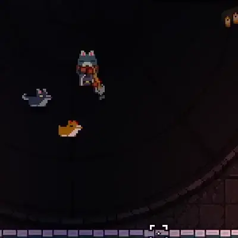

## GungeonCraft: A Mod for Enter the Gungeon

|                                 |                                       |                                      |
| -------------                   | :-------------:                       | :-------------:                      |
|  |                                       |     |
|    |  |  |
|                                 |                                       |                                      |

### Features

- 22 new guns 
- 22 new passive items
- 9 new active items
- Lore for all new guns and items
- A new boss!
- You can pet Junior \o/
- You can become the greatest janitor the Gungeon has ever seen O:

### Goals

- **Balance and Diversity**: no item should be so underwhelming you never want to use it, nor so overpowered you never want to use anything else
- **Fun New Mechanics**: most items and guns should offer their own distinct ways of interacting with the Gungeon, and low tier items shouldn't be low fun items as well
- **Playstyle Variety**: defensive and strategic play should feel as rewarding as aggressive and proactive play

### Known Bugs
* Mid-run saving might not correctly save the internal state of some of the new items
* If you find any more, please let me know!

### FAQ

* Found a Bug?
	- Open an issue on GitHub! Please bear in mind that I work on this in my free time for fun, so I might not fix every bug, but I'll do my best to get to all of the important ones. C:
* Balance or Feature Suggestion?
	- I'm always open to more ideas! But I do have a spreadsheet with 160 or so item ideas in it already, so I probably won't be implementing anything unless it's really intriguing. O:
* Where do I find the new boss?
	- Try talking to Bello a few dozen times! He'll give you a hint eventually (dialogue is RNG and I can't find a way around it D: ).

### Wiki

May or may not be coming soon, but all of the information and lore you'll ever need can be found in-game in the Ammonomicon. O:

### Credits

See the [credits page](credits.md)!
